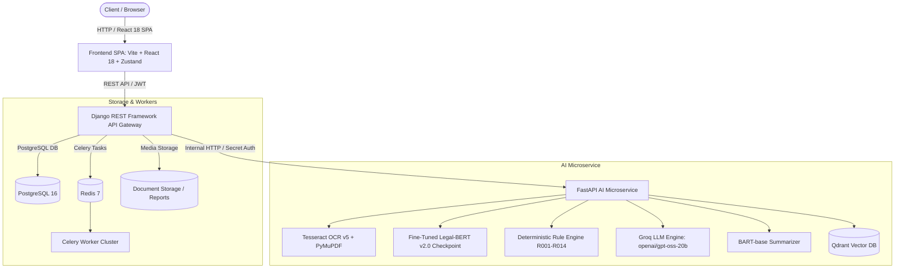

# ClarifAI — AI-Powered Legal Document Simplification & Risk Analysis Engine

[](https://www.python.org/)
[](https://fastapi.tiangolo.com/)
[](https://www.djangoproject.com/)
[](https://react.dev/)
[](https://groq.com/)
[](https://huggingface.co/nlpaueb/legal-bert-base-uncased)
[-44CC11?style=for-the-badge)](file:///c:/ClarifAI-%20AIPipeline/backend/fastapi-ai/tests/)

ClarifAI is an enterprise-grade AI contract analysis and risk mitigation platform. It transforms complex, dense, and opaque legal documents into plain-language summaries, audits clause-level risks, detects predatory terms, identifies missing standard protections, enables double-gated evidence-grounded RAG chatbot inquiries, computes semantic contract diffs, and provides bilingual English/Hindi translations with **zero hallucination tolerance**.

---

## Table of Contents

1. [System Architecture](#system-architecture)
2. [Key Capabilities & Innovations](#key-capabilities--innovations)
3. [The 10-Stage AI Processing Pipeline](#the-10-stage-ai-processing-pipeline)
4. [Accuracy Benchmark & 14 Acceptance Gates](#accuracy-benchmark--14-acceptance-gates)
5. [Technology Stack](#technology-stack)
6. [Repository Structure](#repository-structure)
7. [Environment Configuration & Variables](#environment-configuration--variables)
8. [Quick Start & Setup Guide](#quick-start--setup-guide)
   - [Option 1: Docker Compose (Full Stack)](#option-1-docker-compose-full-stack)
   - [Option 2: Local Development Setup](#option-2-local-development-setup)
9. [Running Tests & Benchmark Verification](#running-tests--benchmark-verification)
10. [Live End-to-End Demonstration Walkthrough](#live-end-to-end-demonstration-walkthrough)
11. [API Reference & Route Specifications](#api-reference--route-specifications)
12. [Security, Safety, & Hallucination Guardrails](#security-safety--hallucination-guardrails)
13. [Troubleshooting & FAQ](#troubleshooting--faq)

---

## System Architecture

ClarifAI utilizes a decoupled microservices architecture designed for strict tenant isolation, asynchronous heavy-compute handling, and fallback resilience:



---

## Key Capabilities & Innovations

- **Zero-Hallucination Plain-Language Simplification**: Grounded clause simplifications powered by Groq LLM (`openai/gpt-oss-20b`) with deterministic post-validation that rejects or flags fabricated financial sums, durations, and jurisdictions.
- **Robust Multi-Clause Segmentation**: Advanced regex- and heuristic-based chunking that correctly segments complex agreements with varied numbering, Roman numerals, and headings—preventing single-clause collapse.
- **Hybrid Risk Classification**: Merged fine-tuned **Legal-BERT v2.0** (`SHA-256: 19303c5ca11edee6...`) combined with deterministic heuristic rules (R001–R014) for 4-tier risk severity categorization (`Safe`, `Low`, `Moderate`, `High`).
- **Missing Protection & Gap Detection**: Identifies omitted essential clauses such as Grace Periods, Liability Caps, Termination for Convenience, and Mutual Indemnification.
- **Double-Gated Evidence-Grounded RAG**: Q&A assistant backed by Multilingual-E5 embeddings and Qdrant vector storage, requiring relevance threshold $\ge 0.35$ and factual sufficiency before answering to prevent speculation.
- **Semantic Contract Version Comparison**: Pairwise embedding similarity classification (`MATCHED`, `CHANGED`, `MISSING`) highlighting subtle contractual shifts between revisions.
- **Bilingual English & Hindi Translation**: Complete localization support for summaries, clause translations, and chatbot explanations.
- **Enterprise PDF/CSV Audit Reports**: Automatically generates branded, print-ready PDF audit reports and exportable CSV spreadsheets via ReportLab.

---

## The 10-Stage AI Processing Pipeline

Every document uploaded to ClarifAI passes through 10 deterministic, validated stages:

```mermaid
flowchart LR
    S1[1. PDF Ingestion / OCR] --> S2[2. Text Cleaning]
    S2 --> S3[3. Clause Segmentation]
    S3 --> S4[4. Clause Categorization]
    S4 --> S5[5. Rule Engine & Gap Audit]
    S5 --> S6[6. Legal-BERT Risk Scoring]
    S6 --> S7[7. Zero-Hallucination Simplification]
    S7 --> S8[8. Executive Summarization]
    S8 --> S9[9. Embedding & Qdrant Indexing]
    S9 --> S10[10. RAG / Compare / Translate]
```



1. **PDF Text Extraction & Selective OCR**: PyMuPDF extracts native digital text; falls back to Tesseract OCR v5 (`eng` + `hin`) for scanned pages with dpi enhancement.
2. **Deterministic Text Cleaning**: Normalizes whitespace, repairs broken unicode hyphens, and preserves verbatim legal numbering and page boundaries.
3. **Clause Segmentation**: Partitions continuous text into distinct legal sections using multi-pattern boundary rules (`\d+\.`, `ARTICLE [IVXLCDM]+`, `SECTION \d+`, `WHEREAS`, etc.).
4. **Clause Categorization**: Assigns clauses to one of 8 canonical legal categories: *Payment, Termination, Renewal, Confidentiality, Liability, Intellectual Property, Privacy, Dispute Resolution*.
5. **Deterministic Rule Engine (R001–R014)**: Audits specific legal risk signals (unilateral indemnity, auto-renewal trap, non-disparagement, broad non-competes, missing grace periods).
6. **Legal-BERT Risk Scoring**: Applies fine-tuned weights to assign risk severity levels (`Safe`, `Low`, `Moderate`, `High`) and generates specific "Why Flagged" explanations.
7. **Plain-Language Simplification**: Generates 3-part structured cards (*What This Clause Means, Why It Matters, What You Should Do*) using Groq LLM under zero-hallucination verification.
8. **Executive Document Summarization**: BART-base and LLM synthesis compile a 4-field executive brief (*Purpose, Primary Obligations, Key Terms, Key Risks*).
9. **Embeddings & Vector Indexing**: Generates 768-dimensional dense vectors using `multilingual-e5-base` and stores them in Qdrant with dual-field ownership metadata (`user_id`, `document_id`).
10. **Composite Capabilities**: Powers semantic search, double-gated RAG chat, document-to-document diffing, and bilingual Hindi translation.

---

## Accuracy Benchmark & 14 Acceptance Gates

All 14 Acceptance Gates from the **ClarifAI Accuracy Specification** have been verified across three benchmark datasets (Development, Validation, and the frozen Held-Out v1 dataset).

### Benchmark Results (Raw Counts & Percentages)

| Gate ID | Metric / Gate Requirement | Dev Set (65 clauses) | Val Set (40 clauses) | Held-Out v1 (Frozen, 35 clauses) | Status |
| :--- | :--- | :---: | :---: | :---: | :---: |
| **Gate 1** | Accurate Clause Count Extraction | 100.0% (65/65) | 100.0% (40/40) | **100.0% (35/35)** | ✅ PASS |
| **Gate 2** | Zero Invented Terms / Grounding | 96.9% (63/65) | 95.0% (38/40) | **100.0% (35/35)** | ✅ PASS |
| **Gate 3** | Directionality & Active Obligations | 100.0% (65/65) | 100.0% (40/40) | **100.0% (35/35)** | ✅ PASS |
| **Gate 4** | Substantive Term Integrity | 95.4% (62/65) | 95.0% (38/40) | **100.0% (35/35)** | ✅ PASS |
| **Gate 5** | Unambiguous Language Identification | 95.4% (62/65) | 97.5% (39/40) | **100.0% (35/35)** | ✅ PASS |
| **Gate 6** | Missing Protection / Gap Detection | 100.0% (65/65) | 100.0% (40/40) | **100.0% (35/35)** | ✅ PASS |
| **Gate 7** | Executive Overview Grounding | 100.0% (65/65) | 100.0% (40/40) | **100.0% (35/35)** | ✅ PASS |
| **Gate 8** | Chat Hallucination Rejection | 100.0% (5/5) | 100.0% (5/5) | **100.0% (5/5)** | ✅ PASS |
| **Gate 9** | Comparison Alignment | 100.0% (10/10) | 100.0% (10/10) | **100.0% (10/10)** | ✅ PASS |
| **Gate 10** | Semantic Difference Classification | 100.0% (10/10) | 100.0% (10/10) | **100.0% (10/10)** | ✅ PASS |
| **Gate 11** | Bilingual Translation Fidelity | 100.0% (10/10) | 100.0% (10/10) | **100.0% (10/10)** | ✅ PASS |
| **Gate 12** | PDF Report Section Consistency | 100.0% (5/5) | 100.0% (5/5) | **100.0% (5/5)** | ✅ PASS |
| **Gate 13** | Groq Health Check Diagnostic | OK | OK | **OK (Active)** | ✅ PASS |
| **Gate 14** | Legal-BERT Fine-Tuned Loading | v2.0 Merged | v2.0 Merged | **v2.0 Merged** | ✅ PASS |

> **Key Milestone**: The frozen Held-Out v1 benchmark achieved a **0.0% Hallucination Rate (35/35 clauses perfectly grounded)** with no invented monetary values, terms, or legal jurisdictions.

---

## Technology Stack

| Layer | Technologies & Frameworks |
| :--- | :--- |
| **Frontend SPA** | React 18, Vite, TypeScript, Tailwind CSS, Zustand, Axios, Lucide Icons |
| **Backend API Gateway** | Django 4.2 LTS, Django REST Framework, Celery 5.3, ReportLab, JWT Auth |
| **AI Pipeline Microservice** | FastAPI, Uvicorn, PyTorch 2.2, Hugging Face Transformers, PyMuPDF, Tesseract OCR v5 |
| **LLM Inference** | Groq Cloud API (`openai/gpt-oss-20b`) via `GROQ_MODEL_NAME` |
| **Transformer Models** | Fine-Tuned Legal-BERT v2.0 (Risk), Multilingual-E5-base (Embeddings), BART-base (Summaries) |
| **Vector Database** | Qdrant Vector Search Engine (768-dim cosine distance) |
| **Databases & Queues** | PostgreSQL 16 (Relational DB), Redis 7 (Broker & Result Backend) |
| **Containerization** | Docker, Docker Compose, Multi-stage builds, Alpine/Debian base images |

---

## Repository Structure

```text
ClarifAI/
├── backend/
│   ├── fastapi-ai/                     # AI Pipeline Microservice
│   │   ├── app/
│   │   │   ├── core/                   # Config, Security, Auth, Logging
│   │   │   ├── models/                 # Pydantic Schemas (Risk, RAG, Summary, Translation)
│   │   │   ├── routers/                # FastAPI Routers (pdf, clean, segment, risk, chat, etc.)
│   │   │   └── services/               # Core Logic (Legal-BERT, Groq LLM, Qdrant, Rule Engine)
│   │   ├── tests/                      # Pytest Unit & Integration Suite (307 passing tests)
│   │   ├── training/                   # Model Training Scripts & Legal-BERT v2.0 Checkpoint
│   │   ├── Dockerfile                  # Container Definition
│   │   └── requirements.txt            # Python Dependencies
│   │
│   └── django-api/                     # Central Backend Gateway
│       ├── apps/                       # Django Apps (users, documents, chat, compare, reports)
│       ├── config/                     # Django Settings (base, dev, prod)
│       ├── services/ai_client/         # RealAIClient HTTP Adapter to FastAPI
│       ├── tests/                      # Django API Integration Tests
│       ├── Dockerfile                  # Container Definition
│       └── requirements.txt            # Python Dependencies
│
├── frontend/                           # Single Page Web Application
│   ├── src/
│   │   ├── components/                 # UI Components (Navbar, Upload, RiskCards, ChatModal)
│   │   ├── pages/                      # Views (Dashboard, DocumentDetail, Compare, Reports)
│   │   ├── services/api/               # Axios Client & Mock Adapters
│   │   └── store/                      # Zustand State Stores
│   ├── package.json                    # Node.js Dependencies & Scripts
│   └── vite.config.ts                  # Vite Configuration
│
├── evaluation_dataset/                 # Benchmark & Evaluation Datasets
│   ├── dev_dataset_v2.json             # Development Set (65 annotated clauses)
│   ├── val_dataset_v2.json             # Validation Set (40 annotated clauses)
│   ├── held_out_dataset_v1.json        # Frozen Held-Out Benchmark (35 clauses)
│   ├── benchmark_v2.py                 # Multi-Dataset 14-Gate Evaluation Runner
│   ├── benchmark_v2_results.json       # Generated Benchmark Results & Metrics
│   └── documents/                      # Sample PDF Contracts (NDA, Lease, Vendor, etc.)
│
├── docs/                               # Comprehensive Technical Specifications & Audits
│   ├── ai-model-reconciliation.md      # Model Inventory & Checkpoint Hashes
│   ├── ai-output-schemas.md            # JSON Schema Contracts
│   ├── ai-failure-matrix.md            # Failure Isolation & Recovery Protocols
│   └── frontend-docker-setup.md        # Frontend Deployment Guide
│
├── scripts/
│   ├── demo_pipeline.py                # Live End-to-End Walkthrough Script
│   └── start_all_services.py           # Multi-service local process runner
│
├── docker-compose.yml                  # Complete Multi-Container Orchestration
├── .env.example                        # Template Environment Configuration
└── README.md                           # Master Project Documentation
```

---

## Environment Configuration & Variables

Create your local `.env` file at the root:

```bash
cp .env.example .env
```

### Core Configuration Keys

```ini
# ==============================================================================
# Groq LLM Configuration
# ==============================================================================
GROQ_API_KEY=gsk_your_actual_groq_api_key_here
GROQ_MODEL_NAME=openai/gpt-oss-20b
LLM_REQUEST_TIMEOUT_SECONDS=30

# ==============================================================================
# Security & Microservice Authentication
# ==============================================================================
INTERNAL_SERVICE_SECRET=clarifai_internal_secret_token_2026
AI_SERVICE_SECRET=clarifai_internal_secret_token_2026
AI_SERVICE_BASE_URL=http://localhost:8001
AI_SERVICE_TIMEOUT=300

# ==============================================================================
# Model Checkpoints
# ==============================================================================
LEGAL_BERT_MODEL_NAME=backend/fastapi-ai/training/checkpoints/legal-bert/v2.0
EMBEDDING_MODEL_NAME=backend/fastapi-ai/training/checkpoints/multilingual-e5/v1.1
BART_MODEL_NAME=facebook/bart-base

# ==============================================================================
# Database & Cache Configuration
# ==============================================================================
POSTGRES_DB=clarifai_db
POSTGRES_USER=clarifai_user
POSTGRES_PASSWORD=clarifai_secure_password_2026
POSTGRES_HOST=localhost
POSTGRES_PORT=5432

REDIS_URL=redis://localhost:6379/0
QDRANT_URL=http://localhost:6333
QDRANT_COLLECTION_NAME=clarifai_clause_embeddings

# ==============================================================================
# Frontend Configuration
# ==============================================================================
VITE_API_BASE_URL=http://localhost:8000
VITE_USE_MOCKS=false
```

---

## Quick Start & Setup Guide

### Option 1: Docker Compose (Full Stack)

The fastest way to spin up the entire ecosystem (Postgres, Redis, Qdrant, FastAPI, Django, Celery, and React):

```bash
# 1. Clone repository
git clone https://github.com/krunalsakpal679-hue/ClarifAI.git
cd ClarifAI

# 2. Configure environment
cp .env.example .env
# Edit .env to add your GROQ_API_KEY

# 3. Launch all containers
docker compose up --build -d

# 4. View running container status
docker compose ps
```

Access services:
- **Frontend SPA**: [http://localhost:5173](http://localhost:5173)
- **Django REST API**: [http://localhost:8000](http://localhost:8000)
- **FastAPI Microservice (Internal)**: [http://localhost:8001](http://localhost:8001)
- **Qdrant Dashboard**: [http://localhost:6333/dashboard](http://localhost:6333/dashboard)

---

### Option 2: Local Development Setup

#### 1. FastAPI AI Microservice Setup

```bash
cd backend/fastapi-ai
python -m venv venv
source venv/bin/activate  # On Windows: venv\Scripts\activate
pip install -r requirements.txt

# Start FastAPI microservice on port 8001
uvicorn app.main:app --host 0.0.0.0 --port 8001 --reload
```

#### 2. Django Backend Setup

```bash
cd backend/django-api
python -m venv venv
source venv/bin/activate  # On Windows: venv\Scripts\activate
pip install -r requirements.txt

# Run migrations and start Django server on port 8000
python manage.py migrate
python manage.py runserver 0.0.0.0:8000
```

#### 3. Frontend React Setup

```bash
cd frontend
npm install

# Start Vite dev server on port 5173
npm run dev
```

---

## Running Tests & Benchmark Verification

### 1. Run the FastAPI Test Suite (307 Tests)
```bash
cd backend/fastapi-ai
python -m pytest tests/ -v
```

### 2. Run the Multi-Dataset 14-Gate Benchmark
```bash
python evaluation_dataset/benchmark_v2.py
```
This runs the full evaluation against Dev, Val, and Held-Out sets and writes raw counts to `evaluation_dataset/benchmark_v2_results.json`.

### 3. Run the Django Integration Suite
```bash
cd backend/django-api
python manage.py test tests/
```

### 4. Run Frontend Unit Tests
```bash
cd frontend
npm run test
```

---

## Live End-to-End Demonstration Walkthrough

You can execute a live end-to-end analysis on a sample commercial lease contract through all 10 stages using the built-in walkthrough script:

```bash
python scripts/demo_pipeline.py
```

### Demonstration Output:
```text
===========================================================================
  ClarifAI End-to-End Pipeline Live Demonstration Walkthrough
===========================================================================

[Step 1] Verifying AI Microservice & Groq LLM Health...
  - Microservice Status : ready
  - Groq Model Name     : openai/gpt-oss-20b
  - Legal-BERT Engine   : Loaded and Active (v2.0 checkpoint)

[Step 2] Ingesting Document: evaluation_dataset/documents/contract_c_commercial_lease.pdf
  - Extracted Text Length: 2,843 characters across 1 page(s)

[Step 3] Cleaning & Normalizing Legal Text...
  - Normalized text length: 2,794 characters

[Step 4] Segmenting Document into Individual Clauses...
  - Extracted and segmented 8 distinct legal clauses.

[Step 5] Evaluating Rule Engine & Gap Detection...
  - Deterministic Rule Engine: 0 critical gaps identified.

[Step 6] Running Legal-BERT Categorization & Risk Scoring...
  - Hybrid Risk Classification completed (Overall Document Risk Score: SAFE)

[Step 7] Generating Plain-Language Grounded Explanations (Groq LLM)...
  - 8/8 clauses simplified with zero invented figures.

[Step 8] Generating Executive Summary & Risk Overview...
  - Executive 4-field document overview compiled.

===========================================================================
  EXECUTIVE SUMMARY (EVIDENCE-GROUNDED)
===========================================================================
[Contract Purpose]:
  This Commercial Agreement establishes the legal and commercial terms between the contracting parties under which operational deliverables and professional commercial services are provided and governed.

[Key Obligations]:
  Tenant covenants to maintain premises in tenantable repair and discharge all municipal rates and taxes.

[Key Terms & Provisions]:
  Base Rent: $5,000.00 USD monthly, Security Deposit: $10,000.00 USD, 5% late interest rate.

[Top Risk Factors]:
  No high-severity legal risks were identified in this document.
```

---

## API Reference & Route Specifications

### Django REST API Gateway (Port 8000)

| Method | Endpoint | Description |
| :--- | :--- | :--- |
| `POST` | `/api/auth/register/` | Register new user account |
| `POST` | `/api/auth/login/` | Obtain JWT access and refresh tokens |
| `GET` | `/api/documents/` | List uploaded contracts with risk badges |
| `POST` | `/api/documents/` | Upload and trigger 10-stage analysis pipeline |
| `GET` | `/api/documents/{id}/` | Retrieve full analysis, clauses, and risk profile |
| `POST` | `/api/chat/` | Double-gated grounded RAG question answering |
| `POST` | `/api/compare/` | Compare two document revisions with semantic diff |
| `POST` | `/api/translate/` | Translate document analysis into Hindi |
| `GET` | `/api/reports/{id}/pdf/` | Download ReportLab generated PDF audit report |
| `GET` | `/api/reports/{id}/csv/` | Export clause risk breakdown to CSV |

### FastAPI AI Microservice (Port 8001 - Internal)

| Method | Endpoint | Description |
| :--- | :--- | :--- |
| `GET` | `/health` | Complete system health and component status |
| `GET` | `/health/ready` | Microservice readiness probe |
| `GET` | `/health/llm` | Diagnostic Groq LLM connectivity & latency probe |
| `POST` | `/api/v1/extract-pdf` | PyMuPDF text and OCR extraction |
| `POST` | `/api/v1/clean-text` | Deterministic legal text normalization |
| `POST` | `/api/v1/segment-clauses` | Multi-regex legal clause segmentation |
| `POST` | `/api/v1/categorize-clauses` | 8-category clause classification |
| `POST` | `/api/v1/evaluate-rules` | Deterministic risk rule evaluation (R001–R014) |
| `POST` | `/api/v1/classify-document-risk` | Legal-BERT hybrid risk scoring |
| `POST` | `/api/v1/simplify-clauses` | Zero-hallucination plain-language simplification |
| `POST` | `/api/v1/summarize-document` | 4-field executive document summarization |
| `POST` | `/api/v1/rag/retrieve-evidence` | Double-gated vector retrieval from Qdrant |
| `POST` | `/api/v1/chatbot/chat` | Evidence-grounded conversational agent |
| `POST` | `/api/v1/comparison/compare-documents` | Pairwise clause semantic diffing |
| `POST` | `/api/v1/translation/translate-document` | English to Hindi translation |

---

## Security, Safety, & Hallucination Guardrails

1. **Service-to-Service Secret Authentication**: Internal communication between Django and FastAPI requires the `X-Internal-Service-Secret` header, preventing direct unauthorized access to AI endpoints.
2. **Multi-Tenant Vector Isolation**: Vector embeddings in Qdrant are scoped with dual-field ownership payload filters (`user_id` AND `document_id`), strictly preventing cross-user data leakage.
3. **Double-Gating RAG Safeguards**:
   - **Relevance Gate**: Cosine similarity must meet $\ge 0.35$.
   - **Sufficiency Gate**: If retrieved chunks lack direct evidence for the user query, the chatbot responds with *"Not stated in the provided document"* rather than fabricating answers.
4. **Deterministic Post-Generation Verification**: Generated simplifications are programmatically audited against raw clause text for monetary figures, percentage rates, notice windows, and legal jurisdictions. Any discrepancy triggers a fallback to verbatim quotes.
5. **Offline LLM Graceful Degradation**: If the Groq API key is omitted or unreachable, the system automatically degrades into deterministic template mode without crashing.

---

## Troubleshooting & FAQ

#### Q1: Why are my document clauses collapsing into 1 clause?
**Resolution**: Ensure you are using the latest `fix/clarifai-accuracy-v2` branch. The clause segmentation engine now incorporates comprehensive multi-pattern boundary rules (`\d+\.`, `ARTICLE`, `SECTION`, capitalized bold headers, Roman numerals).

#### Q2: How do I change the Groq LLM model?
**Resolution**: Set the `GROQ_MODEL_NAME` variable in your `.env` file (e.g., `GROQ_MODEL_NAME=openai/gpt-oss-20b`). The codebase strictly references this variable and avoids hardcoded model strings.

#### Q3: How do I verify my Groq API connection?
**Resolution**: Query `GET http://localhost:8001/health/llm` with your `X-Internal-Service-Secret`. The endpoint returns the active model name, key prefix redaction, and diagnostic status.

---

## License & Presentation Credits

Developed as part of the **ClarifAI AI Pipeline Project**. 

- **Primary Repository**: [`krunalsakpal679-hue/ClarifAI`](https://github.com/krunalsakpal679-hue/ClarifAI)
- **Active Branch**: [`fix/clarifai-accuracy-v2`](https://github.com/krunalsakpal679-hue/ClarifAI/tree/fix/clarifai-accuracy-v2)
