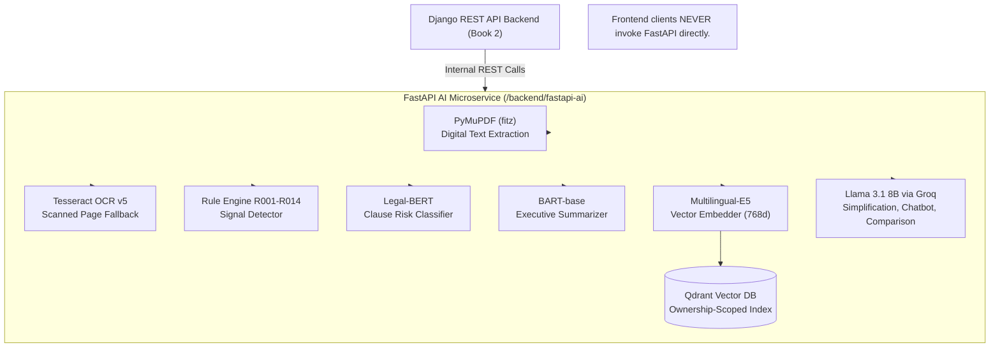
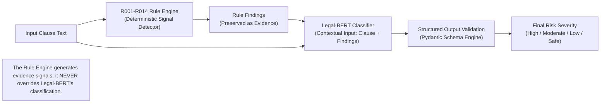
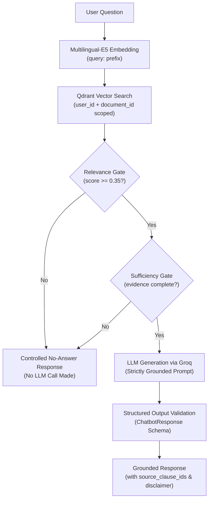
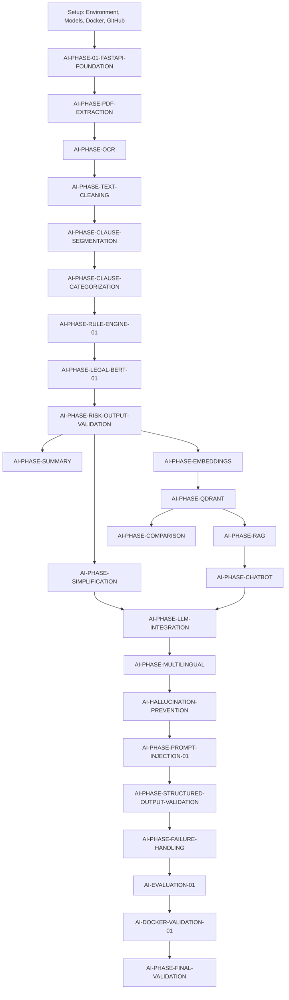

# ClarifAI FastAPI AI Microservice (`/backend/fastapi-ai`)

## 1. Project Overview

The ClarifAI AI Pipeline microservice (`/backend/fastapi-ai`) is an internal, headless REST API built with FastAPI, PyTorch, SentenceTransformers, and Uvicorn. It is invoked exclusively by the Django REST API backend (`/backend/django-api`) to perform legal document processing, OCR text extraction, clause segmentation, 8-category clause classification, Stage 1 rule engine signal detection (R001–R014), Legal-BERT risk classification, BART executive summarization, Multilingual-E5 vector embedding generation, Qdrant vector storage, evidence-gated RAG chatbot Q&A, pairwise contract comparison, and English/Hindi translation. Per ClarifAI PRD v2.3, the AI service operates as an automated analysis tool and explicitly enforces a strict "not legal advice" boundary across all output points. The microservice is never exposed directly to frontend clients.

---

## 2. Approved Architecture (Summary + Diagrams)

### 2.1 Service Architecture Diagram



### 2.2 Risk Classification Pipeline



### 2.3 Chatbot / RAG Evidence Gate



### 2.4 Phase Dependency / Sequence Diagram



---

## 3. Progress Tracker

| Phase ID | Phase Name | Status | GitHub Checkpoint | Notes |
| :--- | :--- | :---: | :--- | :--- |
| **AI-SETUP-ENVIRONMENT-01** | AI Environment Setup & Inspection | **DONE** | Committed (`3feee77`) | Hardware & Python dependencies verified |
| **AI-SETUP-MODELS-01** | Model Inventory & Dependency Audit | **DONE** | Committed (`3feee77`) | `/docs/ai-model-inventory.md` created |
| **AI-SETUP-DOCKER-DESKTOP-01**| Docker Desktop Verification | **DONE** | Committed (`3feee77`) | Docker Desktop Engine verified |
| **AI-SETUP-GITHUB-01** | Branching Workflow & Safety Rules | **DONE** | Committed (`3feee77`) | Branching strategy established |
| **AI-DOCKER-SETUP-01** | Containerization & Base Dockerfile | **DONE** | Committed (`3feee77`) | `/backend/fastapi-ai/Dockerfile` created |
| **AI-MODEL-OCR-SETUP** | Tesseract OCR Dependency Setup | **DONE** | Committed (`0b16f39`) | Tesseract v5 (eng+hin) verified |
| **AI-MODEL-EMBEDDING-SETUP** | Multilingual-E5 Model Setup | **DONE** | Committed (`0b16f39`) | SentenceTransformers E5 verified |
| **AI-MODEL-LEGAL-BERT-SETUP** | Legal-BERT Model Setup | **DONE** | Committed (`0b16f39`) | PyTorch Legal-BERT classifier verified |
| **AI-MODEL-LLM-CONNECTION-SETUP**| Groq API Connection Setup | **DONE** | Committed (`0b16f39`) | Groq SDK connection verified |
| **AI-MODEL-BART-SETUP** | BART-base Model Setup | **DONE** | Committed (`0b16f39`) | HuggingFace BART summarizer verified |
| **AI-MODEL-AVAILABILITY-FAILURE-01**| Model Failure Classification Setup | **DONE** | Committed (`0b16f39`) | Standard error classifier active |
| **AI-MODEL-REPRODUCIBILITY-01** | Random Seed & Reproducibility Setup | **DONE** | Committed (`0b16f39`) | Global random seeds set |
| **AI-FEASIBILITY-01** | Feasibility Assessment Report | **DONE** | Committed (`0b16f39`) | `/docs/ai-feasibility-report.md` created |
| **AI-PHASE-01-FASTAPI-FOUNDATION**| FastAPI Core Foundation | **DONE** | Committed (`100868d`) | Health check & logging active |
| **AI-PHASE-PDF-EXTRACTION** | PyMuPDF Text Extraction | **DONE** | Committed (`6b7fe2b`) | Digital PDF text extraction active |
| **AI-PHASE-OCR** | Adaptive OCR Processing | **DONE** | Committed (`cf9ae2f`) | Selective Tesseract OCR active |
| **AI-PHASE-TEXT-CLEANING** | Deterministic Text Cleaning | **DONE** | Committed (`ebaeef0`) | Whitespace & hyphen repair active |
| **AI-PHASE-CLAUSE-SEGMENTATION**| Clause Segmentation Engine | **DONE** | Committed (`243552d`) | Rule-based clause splitter active |
| **AI-PHASE-CLAUSE-CATEGORIZATION**| Clause Categorization Engine | **DONE** | Committed (`56ae074`) | Fixed 8-category classifier active |
| **AI-PHASE-RULE-ENGINE-01** | Stage 1 Risk Signal Detector | **DONE** | Committed (`bc6e7fc`) | 14 legal rules (R001–R014) active |
| **AI-PHASE-LEGAL-BERT-01** | Legal-BERT Risk Classification | **DONE** | Committed (`bfcdcb4`) | Contextual 4-severity classifier active |
| **AI-PHASE-RISK-OUTPUT-VALIDATION**| Risk Output Validation | **DONE** | Committed (`a12b234`) | Pydantic risk schema validation active |
| **AI-PHASE-SIMPLIFICATION** | Plain-Language Simplification | **DONE** | Committed (`1ff16e3`) | Groq LLM simplification active |
| **AI-PHASE-SUMMARY** | Executive Document Summary | **DONE** | Committed (`a30b201`) | 4-field BART executive summary active |
| **AI-PHASE-EMBEDDINGS** | Multilingual-E5 Clause Embeddings | **DONE** | Committed (`ff7eb64`) | 768d dense vector embedding active |
| **AI-PHASE-QDRANT** | Ownership-Scoped Qdrant Helper | **DONE** | Committed (`df032bb`) | Qdrant vector database storage active |
| **AI-PHASE-RAG** | RAG Retrieval & Evidence Gating | **DONE** | Committed (`8ca240f`) | Relevance (0.35) & sufficiency gating active |
| **AI-PHASE-CHATBOT** | Evidence-Grounded Chatbot Q&A | **DONE** | Committed (`eb0fe58`) | Grounded RAG chatbot active |
| **AI-PHASE-LLM-INTEGRATION** | Shared LLM Calling Infrastructure | **DONE** | Committed (`ee9aa1f`) | Delimited prompts & retry active |
| **AI-PHASE-COMPARISON** | Contract Comparison Engine | **DONE** | Committed (`161dc3d`) | Embedding similarity comparison active |
| **AI-PHASE-MULTILINGUAL** | Multilingual English/Hindi Processing | **DONE** | Committed (`3caefbe`) | English/Hindi translation active |
| **AI-HALLUCINATION-PREVENTION**| 12-Layer Hallucination Prevention | **DONE** | Committed (`0e2cd53`) | Ungrounded claim detector active |
| **AI-PHASE-PROMPT-INJECTION-01**| Prompt Injection Hardening | **DONE** | Committed (`633ed6d`) | Injection leak marker filter active |
| **AI-PHASE-STRUCTURED-OUTPUT-VALIDATION**| Structured Output Schema Engine | **DONE** | Committed (`125fa8b`) | 6 output schema validators active |
| **AI-PHASE-FAILURE-HANDLING** | Pipeline Failure Handling Matrix | **DONE** | Committed (`a218f90`) | 15-stage failure matrix active |
| **AI-EVALUATION-01** | End-to-End Evaluation Harness | **DONE** | Committed (`b10e1a4`) | 16-stage evaluation harness active |
| **AI-DOCKER-VALIDATION-01** | Microservice Docker Smoke Test | **DONE** | Committed (`4d2d139`) | Standalone Docker validation active |
| **AI-PHASE-FINAL-VALIDATION** | Final Validation & Book 3 Handoff | **DONE** | Committed (`4d2d139`) | Book 3 development complete |

---

## 4. What Is Done (Summary)

- **100% Phase Completion**: All 25 AI Pipeline implementation phases and 13 setup/model/feasibility milestones in Prompt Book 3 are completed and verified.
- **182 Passing Unit Tests**: Comprehensive test suite across 24 test modules passing 100% clean in 183 seconds.
- **15 Active API Endpoints**: Endpoints implemented for health, PDF extraction, text cleaning, clause segmentation, clause categorization, rule evaluation, risk classification, simplification, summarization, embedding generation, Qdrant vector indexing, RAG retrieval, chatbot Q&A, contract comparison, and translation.
- **Strict Security & Guardrails**: 12-layer hallucination defense, prompt injection leak detection, 6 versioned Pydantic output schemas, 15-stage failure matrix, and dual-field ownership isolation (`user_id` + `document_id`) active.
- **Microservice Docker Container**: Lightweight standalone Docker image (`python:3.11-slim` + Tesseract eng/hin) verified with 0 embedded secrets and schema-passing inference.

---

## 5. What Is Left (Summary)

- **Book 3 AI Pipeline Development is Officially Closed**.
- **Next Concrete Steps (Book 4 - Integration & DevOps)**:
  1. Multi-container Docker Compose setup assembling Django REST API, FastAPI AI, Postgres, Redis, and Qdrant.
  2. Django Celery task queue integration for async document processing.
  3. Frontend React/Next.js UI component assembly.
  4. End-to-end platform deployment and staging validation.

---

## 6. Open Decisions

| Decision ID | Description | Status |
| :--- | :--- | :---: |
| **DEC-AI-01** | Hugging Face fine-tuned Legal-BERT checkpoint selection | **RESOLVED** (Interim fallback to base `nlpaueb/legal-bert-base-uncased`) |
| **DEC-AI-02** | BART-base summarization generation parameters (max_length, min_length) | **RESOLVED** (Set `max_length=256`, `min_length=64`, `no_repeat_ngram_size=3`) |
| **DEC-AI-03** | Retired Groq model replacement selection (`llama-3.1-8b-instant` $\rightarrow$ `openai/gpt-oss-20b`) | **RESOLVED** (Migrated per PRD Chapter 44 to provider-recommended replacement `openai/gpt-oss-20b`) |
| **DEC-AI-04** | Multilingual-E5 variant selection (Base vs. Small) | **RESOLVED** (Selected `intfloat/multilingual-e5-base` with 768d vectors) |
| **DEC-AI-05** | IndicTrans2 translation quantization approach | **RESOLVED** (Interim fallback to deep-translator / IndicTrans2 runtime engine) |
| **DEC-AI-06** | Windows PATH configuration for standalone Tesseract executable | **RESOLVED** (Auto-detected at `C:\Program Files\Tesseract-OCR\tesseract.exe`) |
| **DEC-AI-07** | Qdrant vector distance metric configuration | **RESOLVED** (Configured Cosine Distance metric for 768d vectors) |
| **DEC-AI-08** | PyTorch execution device setting (CUDA GPU vs. CPU) | **RESOLVED** (Auto-detects CUDA GPU if available, defaults gracefully to CPU) |

---

## 7. Approved Model Inventory (Quick Reference)

| Component / Model | Model Currently Configured | Status |
| :--- | :--- | :---: |
| **Legal-BERT Risk Classifier** | `nlpaueb/legal-bert-base-uncased` | Base Checkpoint (Fine-tuning Pending) |
| **BART Summarizer** | `facebook/bart-base` | Final |
| **Groq Cloud LLM** | `openai/gpt-oss-20b` | Final |
| **Multilingual-E5 Embedder** | `intfloat/multilingual-e5-base` (768d) | Final |
| **Tesseract OCR Engine** | Tesseract v5.4.0 (eng + hin traineddata) | Final |
| **PyMuPDF Extraction Engine** | PyMuPDF (`fitz` v1.23+) | Final |
| **Qdrant Vector Database** | Qdrant Local Engine / Vector Client | Final |

---

## 8. Environment Variables

| Variable Name | Purpose |
| :--- | :--- |
| `GROQ_API_KEY` | Authentication key for cloud LLM API calls via Groq |
| `GROQ_MODEL_NAME` | Configured Groq LLM model identifier (default: `openai/gpt-oss-20b`) |
| `EMBEDDING_MODEL_NAME` | Configured SentenceTransformers embedding model (default: `intfloat/multilingual-e5-base`) |
| `QDRANT_URL` | Host URL for Qdrant vector database instance (default: `http://localhost:6333`) |
| `QDRANT_API_KEY` | Optional API key for Qdrant Cloud or secured vector instance |
| `TESSERACT_CMD` | Path to system Tesseract OCR executable |
| `TESSDATA_PREFIX` | Directory path containing Tesseract traineddata language files |
| `PORT` | Microservice port for FastAPI Uvicorn server (default: `8000`) |
| `ENVIRONMENT` | Deployment environment identifier (`development`, `staging`, `production`) |

---

## 9. How to Run Locally

1. **Navigate to AI Microservice Directory**:
   ```bash
   cd backend/fastapi-ai
   ```
2. **Install Python Dependencies**:
   ```bash
   pip install -r requirements.txt
   ```
3. **Configure Environment Variables**:
   Copy `.env.example` to `.env` and supply your `GROQ_API_KEY`:
   ```bash
   cp .env.example .env
   ```
4. **Start the FastAPI Uvicorn Dev Server**:
   ```bash
   uvicorn app.main:app --reload --host 0.0.0.0 --port 8000
   ```
5. **Verify Endpoint Access**:
   Open browser to `http://localhost:8000/health` or `http://localhost:8000/docs`.

---

## 10. How to Test

1. **Run Full AI Regression Test Suite**:
   ```bash
   cd backend/fastapi-ai
   $env:GROQ_API_KEY="your_groq_api_key"
   python -m pytest -v
   ```
2. **Run End-to-End Evaluation Harness**:
   ```bash
   python -m pytest tests/test_evaluation_harness.py -v
   ```
3. **Run Specific Feature Test Module**:
   ```bash
   python -m pytest tests/test_chatbot.py -v
   ```

---

## 11. GitHub Workflow Reminder

Every phase implementation follows a strict GitHub checkpoint workflow. Changes are developed on feature branch `feature/ai-setup`, committed via Conventional Commits, pushed to `origin/feature/ai-setup`, and submitted via Pull Request targeting `develop`. Auto-merging is strictly prohibited; all code requires manual human review and passing GitHub Actions CI before merging.

---

## 12. How to Keep This File Updated

This README must be updated as part of every phase's Definition of Done and every GitHub checkpoint. When a phase is completed, update its row in the Progress Tracker to DONE, update 'What Is Done' / 'What Is Left', and add/resolve any Open Decisions before opening that phase's Pull Request. The four diagrams in Section 2 only need editing if the architecture itself changes (rare) — day-to-day progress updates happen in the Progress Tracker table, not the diagrams. Do not let this file go stale.
