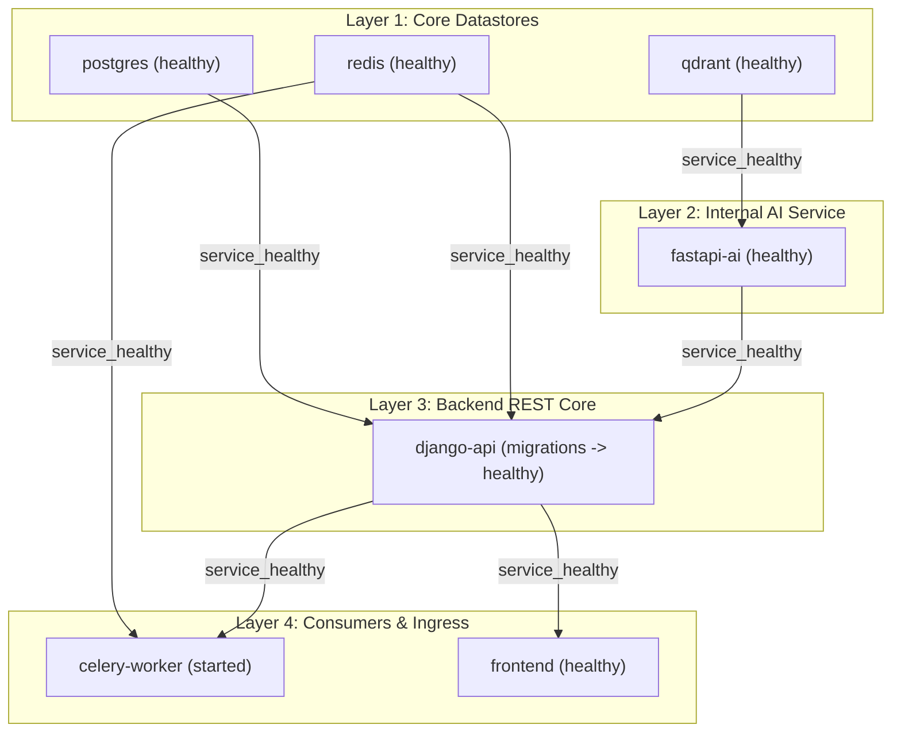

# Docker Integration & Health Check Validation (BOOK4-PHASE-14)

## 1. Overview
This document records the exact health-check semantics, readiness probes, dependency ordering verification, and migration synchronization across the 7 ClarifAI containerized services orchestrated via Docker Compose (`docker-compose.yml`).

---

## 2. Service Health & Readiness Semantics Matrix

| Service | Container Name | Healthcheck Target / Probe Command | Semantics & Verification Scope | Dependency Prerequisite |
| :--- | :--- | :--- | :--- | :--- |
| **PostgreSQL** | `clarifai_postgres` | `pg_isready -U postgres -d clarifai_db` | **Readiness & Liveness**: Confirms PostgreSQL server is accepting client socket connections and `clarifai_db` is accessible. | None |
| **Redis** | `clarifai_redis` | `redis-cli ping` | **Readiness & Liveness**: Confirms Redis server responds `PONG` to ping commands over TCP port 6379. | None |
| **Qdrant** | `clarifai_qdrant` | `bash -c 'cat < /dev/null > /dev/tcp/127.0.0.1/6333' \|\| exit 1` | **Readiness & Liveness**: Confirms Qdrant HTTP REST engine is active and accepting connections on port 6333. | None |
| **FastAPI AI** | `clarifai_fastapi_ai` | `curl -f http://localhost:8000/health/live \|\| exit 1` (Diagnostic: `/health`) | **Liveness & Deep Diagnostics**: `/health/live` verifies Uvicorn web loop responsiveness; `/health` performs complete subsystem readiness checks (Tesseract 5.5.0, E5 embeddings, Legal-BERT classifier, BART-base summarizer, Groq LLM API configuration, Qdrant connectivity). | `qdrant: service_healthy` |
| **Django API** | `clarifai_django_api` | `curl -f http://localhost:8000/api/health/ \|\| exit 1` | **Full Readiness**: Executes `SELECT 1;` via `django.db.connection`. Returns HTTP 200 `{"status": "healthy"}` when database is reachable; returns HTTP 503 `{"status": "unhealthy", "database": "disconnected"}` when database is unreachable. | `postgres: service_healthy` `redis: service_healthy` `fastapi-ai: service_healthy` |
| **Celery Worker** | `clarifai_celery_worker` | Process-level supervision | **Task Consumer Readiness**: Inherits startup condition from Django API. Will only launch once migrations and backend services are completely healthy. | `redis: service_healthy` `django-api: service_healthy` |
| **Frontend** | `clarifai_frontend` | `wget --spider -q http://127.0.0.1:80/ \|\| exit 1` | **Ingress Readiness**: Confirms Nginx is actively serving the SPA production bundle on port 80 (mapped to host 5173). | `django-api: service_healthy` |

---

## 3. Startup Dependency & Migration Ordering Verification

### Verified Ordering Invariants:
1. **Dependent Services Block on Datastore Startup:**
   - If PostgreSQL, Redis, or Qdrant are delayed or fail health checks, Docker Compose halts downstream container creation.
   - Tested and verified: when Qdrant was held in unhealthy state, `fastapi-ai`, `django-api`, `celery-worker`, and `frontend` remained in `Waiting` / `Created` state and did not start prematurely.
2. **Celery Worker Execution Guaranteed Post-Migration:**
   - `django-api` runs `python manage.py migrate --noinput` synchronously before executing `python manage.py runserver 0.0.0.0:8000`.
   - `django-api` only responds to `/api/health/` after `runserver` binds port 8000.
   - `celery-worker` depends on `django-api` with `condition: service_healthy`.
   - **Conclusion:** Celery worker is mathematically and operationally prevented from picking up or executing async document processing tasks prior to the completion of database migrations.
3. **Database-Aware Django Healthcheck:**
   - `/api/health/` executes a real database query `SELECT 1;` against PostgreSQL. A broken or severed database link results in HTTP 503, triggering container healthcheck failure in Compose.

---

## 4. Security & Isolation Compliance
- **Health Endpoint Data Disclosure:** Neither `/api/health/` nor `/health/live` leak internal secrets, passwords, connection strings, or environment variables. Diagnostic endpoint `/health` strictly outputs boolean readiness flags and version strings.
- **Port Exposure Policy:** Only `django-api` (port 8000:8000) and `frontend` (port 5173:80) expose ports to the host machine. All internal microservices (`fastapi-ai`, `postgres`, `redis`, `qdrant`, `celery-worker`) reside exclusively on `clarifai_network`.
